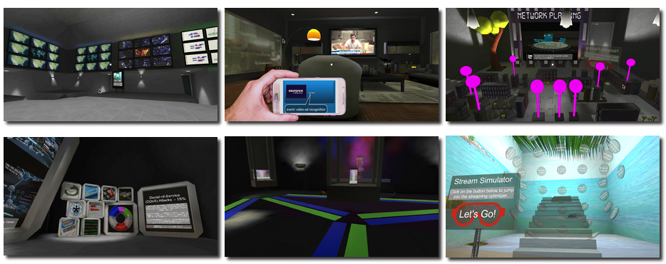

# udnd_05_museum
This is a "museum" application for exploring Telecommunications Innovations in XR (TiXR).

## Design Documentation
Looking for design documentation? Look no further than the [docs](docs/README.md) folder!

## Screenshot overview
A montage of the exhibits within the TiXR museum.

## Project Contents
Quick description of contents within this repo.

* Assets - assets including GoogleVR SDK clips for project
* ProjectSettings - project settings for builds
* .gitignore - ignore file based on Unity footprint
* build.zip - compressed build for Android (stored via [git lfs](https://git-lfs.github.com/))
* LICENSE - current license
* README.md - this file
* docs/ - examples of screenshots and solutions to puzzles

### Customizations
The major parts of this project were built from the ground up, using the source
material and how it could adapted as min-games as the driving motivation.  Please
check out the [design documentation](docs/README.md) for more information.

## Requirements
Software and build environment requirements.

* [Unity 2017.3.0f3](https://unity3d.com/get-unity/download/archive)
* [GVR Unity SDK v1.60.0](https://github.com/googlevr/gvr-unity-sdk/releases/tag/v1.60.0)
* Android KitKat 4.4 or later

### Extra Assets
A few extra assets were used in the creation of this project.  A best effort attempt includes the original source for this content and associated *free* AssetStore Assets (placed in the [extra](Assets/external) folder).

* https://www.pexels.com/photo/android-blur-cellular-close-up-301718/
* https://www.pexels.com/photo/gray-smartphone-37864/
* http://custommapmakers.org/skyboxes.php
* Rug texture - http://www.lughertexture.com/carpet/rug-contemporary-8-2889
* Simplify Art - http://simplify.thatsh.it/
* https://soundcloud.com/the-mighty-low/ice-waves-rock-ambient-light-up-tempo-inspiring
* https://www.soundjay.com/footsteps-1.html
* https://www.audioblocks.com/stock-audio/museum-exhibition-hall-ambience-100152.html
* https://www.calyptix.com/top-threats/top-8-network-attacks-type-2017/
* http://news.buzzbuzzhome.com/2014/12/miniature-city-models.html
