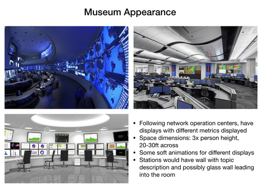
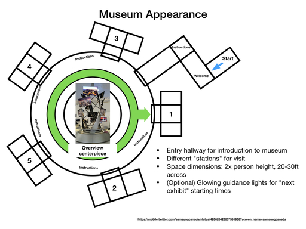
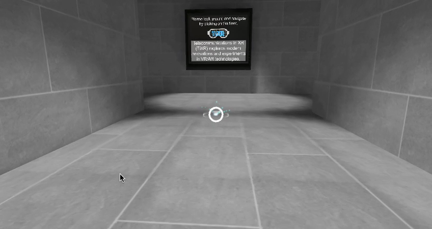

Statement of Purpose
===
This write-up describes the creation of the Telecommunications in XR Museum (TiXR).  The museum highlights a number of recent technology advancements by demonstrating a use case along with video or images and ideally an interactive mini-game.  These games range from simple exploration of the concept in place to custom VR interactions based on the one facet of the technology.  The term *XR* is adapted instead of VR or AR alone because most of the concepts discussed can be applied to one or more of the experiences with few differences.

### Table of Contents
1. [Introduction to the application](#Introduction)
   1. [Personas](#Personas)
2. [Creating the Museum](#Creating-the-Museum)
   1. [Background](#Background)
      1. [Museum Cohesion](#Overall-Museum-Cohesion)
      2. [Individual Experiences](#Experience-Design)
   2. [Interactions](#Interactions)
      1. [Gameplay](#Gameplay)
3. [User testing for project status](#User-testing)
4. [Final walk-through](#Final-Walkthrough)
    1. [Struggles and Compromises](#Struggles-and-Compromises)
5. [Conclusion](#Conclusion)

# Introduction
The inspiration for the Technologies in XR (TiXR) Museum idea came from personal experience in the area.  As a practitioner in the field and follower of XR technology, a summarization of recent innovations within an interactive application felt quite natural to the creator.  As with other beginner, non-game applications, the over-arching goals of this application were to present an engaging experience to the users and provide a suitable set of tools that would embrace intermediate lessons about interactions in VR, usability of tools created within applications, and general development in the Unity environment.

## Personas
Around the same time that  initial thoughts about what type of "museum" to create, there was mention of a possible STEM (Science, Technology, Engineering, and Mathematics) event in the creator's local area.  Thus, the personas selected for highlight and fulfillment in this task were chosen to inspire both peer-level engineering and younger educational requirements.

### Abi
* Occupation: Student
* Age: teenager
* Quote: "While I'm interested in STEM participation, I'm not sure where I fit into what I'm hearing."
* Description: Linda is a typical teenager with early interests in science.  She completed some coding exercises on her own and went to after school clubs that offered some Lego and robotics assembly.  On her own, she watches on-line videos about various maker topics but still spends a lot of time in social apps like Musically.  She has her own phone but thus far hasn't been interested in VR specifically.  Linda has a healthy set of extracurricular activities like soccer and manages most of her time obligations by herself.
* Experience with VR: Little, mostly experimentations
* [pexels.com source](https://www.pexels.com/photo/girl-learning-person-studying-159810/)
* 

### Jill
* Occupation: Network Engineer
* Age: late 40's
* Quote: "I enjoyed updating my skills and am eager to show how automation can help!"
* Description: Jill is in her mid to late career but hopes to reboot her career in the world of machine learning and automation after taking a MOOC course about machine learning.  Over a period of two years, she took three courses after-work to complete a masters degree through distance learning.  She's done the work, followed the lessons, and is eager to immediately apply what she learned to her real job -- and reap the rewards for doing so.
* Experience with VR: None
* [link to this quiz post](https://discussions.udacity.com/t/quiz-responses-create-a-persona-for-puzzler/203143/220?u=robotvisiondr), [pexels.com source](https://www.pexels.com/photo/adult-brainstorming-business-career-440588/)
* 

# Creating the Museum
The TiXR museum was created in stages similar to the design steps in this document: abstracting the ideas and recent technologies that could be represented, imagining how they may be displayed within a virtual museum, imagining a cohesive design for a single museum, and then validating some of the interactive games to be included for each exhibit.

## Background
One requirement of the project was to have five different experiences.  After initial thoughts about topics of interest, the following areas were picked for highlights within the application: network diagnostics and security, network planning, 360 and immerse optimizations, enhanced content interactions, and intelligent AR caching.  With these ideas in mind, some design ideas were explored through existing museum displays that people found appealing -- and consequently posted on social sites like [Pinterest](http://www.pinterest.com).  

### Overall Museum Cohesion
Although the application is a "museum", the notion of an overall operations or "brain" center of these applications was already quite established.  Through a few industries (aviation, telecommunications, etc.) the a *network operations center* (NOC) concept exists as a way to consolidate the expertise of many individuals in a single room.  For that reason, it seemed natural to create a central control room for the museum in the same spirit.  

* The first design demonstrates a set of NOCs with compact seats, specific lighting themes, and usually a focus on a single wall or location as a target. 
* The second design illustrates the planned spatial layout for different rooms, with a central/hub at the focus of all exhibits, much like the NOC concept. 

 

### Experience Design
tbd

## Interactions
TBD

### Gameplay
* Navigation and interactions with objects; meshes and triggers for walking plane
* Creating [analytics triggers](https://stackoverflow.com/a/23052854) for entry and exit of rooms
* Linking triggers to audio and content activation for volume control

### Exhibits
TBD
* Creating [analytics triggers](https://stackoverflow.com/a/23052854)

# User testing
## Initial Usability
Initially the user was pleased with the environment, but a few spatial oddities did set in. Namely, the user complained that the movement felt artificial and that the visual height of the movement (or the presence in the world) felt 'off'.  Additionally, the primary test user found the initial textures chosen (wall and floor textures) to be quite atypical for a museum display.  To address these issues, the following modifications were made.

1. *navigation* - Added walking sounds while in motion; this sound is a simple foot-step loop
with four steps to give some minor variance
2. *movement* - Brought the camera closer to the ground
3. *orientation* - Guaranteed a consistent viewing angle (e.g. no in-game camera rotation)
4. *movement* - Various speeds for the camera walk such that it eases out of the movement; different tweening types and teleporting was also attempted but neither was well received.
5. *appearance* - Modified the texture to cleaner, simpler textures. 

## Final Usability
Watch the complete [walkthrough video](https://youtu.be/xj3qLvDK4gQ).

# Final Walkthrough
This section iterates design choices (and their point in the above video) for each part of the experience.

* **The Entry Path** adfad
    * 
* **The Center / NOC** adfad
* **Enhanced Content** adfad
* **Network Planning** adfad
* **Diagnostics and Security** adfad
* **Cached Content** adfad
* **360 Encoding** adfad

TBD

## Struggles and Compromises
* Problems with Network - lay objects over for easier interaction
* Problems with video - jumpy mp4 files for skybox like usage; find video sources
from youtube but not using them now
TBD

### Comments
* Struggles (and learning opportunities) overcome
    * video encoding for the project; still unsolved for some content
    * creation of the main environment (learned a new tool, [ProBuilder](http://www.procore3d.com/probuilder/))
    * integration of tweening for smooth animations, switched to [LeanTween](http://dentedpixel.com/LeanTweenDocumentation/classes/LeanTween.html)
    * faulty rendering with large-memory objects (render engine as GLES), [answered with some forum help](https://discussions.udacity.com/t/all-white-textures-rendering-on-android-app/502165/2)

# Conclusion
TBD

## Future work

* Future TODO:
    * Add furniture to main room for NOC-style viewership
    * Add moving videos or something dynamic to displays in main room
    * Make a game or inspection requirement for net room
    * Improve lighting of toy city in net room; finish game in net planning room
    * Add ceiling lighting for main room
    * Finish interaction in cache room (zapping and moving visuals along ground)
* Tuning for usability
    * video load lagging and [eliminating jitter and delay](https://answers.unity.com/questions/17409/best-video-preparation-for-unity.html)
    * Unity color palette for low-vision - http://bconnelly.net/2013/10/creating-colorblind-friendly-figures/, http://www.perbang.dk/rgbgradient/
