Statement of Purpose
===
This write-up describes the creation of the Telecommunications in XR Museum (TiXR).  The museum highlights a number of recent technology advancements by demonstrating a use case along with video or images and ideally an interactive mini-game.  These games range from simple exploration of the concept in place to custom VR interactions based on the one facet of the technology.  The term *XR* is adapted instead of VR or AR alone because most of the concepts discussed can be applied to one or more of the experiences with few differences. 

### Table of Contents
1. [Introduction to the application](#introduction)
   1. [Personas](#personas)
2. [Creating the Museum](#creating-the-museum)
   1. [Background](#background)
      1. [Museum Cohesion](#overall-museum-cohesion)
      2. [Individual Experiences](#experience-prototyping)
   2. [Interactions](#interactions)
      1. [Gameplay](#gameplay)
3. [User testing for project status](#user-testing)
4. [Final walk-through](#final-walkthrough)
    1. [Struggles and Compromises](#struggles-and-compromises)
    2. [Comments](#comments)
5. [Conclusions](#conclusions)
    1. [Future Work](#future-work)

# Introduction
The inspiration for the Technologies in XR (TiXR) Museum idea came from personal experience in the area.  As a practitioner in the field and follower of XR technology, a summarization of recent innovations within an interactive application felt quite natural to the creator.  As with other beginner, non-game applications, the over-arching goals of this application were to present an engaging experience to the users and provide a suitable set of tools that would embrace intermediate lessons about interactions in VR, usability of tools created within applications, and general development in the Unity environment.

## Personas
Around the same time that  initial thoughts about what type of "museum" to create, there was mention of a possible STEM (Science, Technology, Engineering, and Mathematics) event in the creator's local area.  Thus, the personas selected for highlight and fulfillment in this task were chosen to inspire both peer-level engineering and younger educational requirements.

### Abi
<table>
  <tr ><td width='50%'>

* Occupation: Student
* Age: teenager
* Quote: "While I'm interested in STEM participation, I'm not sure where I fit into what I'm hearing."
* Description: Linda is a typical teenager with early interests in science.  She completed some coding exercises on her own and went to after school clubs that offered some Lego and robotics assembly.  On her own, she watches on-line videos about various maker topics but still spends a lot of time in social apps like Musically.  She has her own phone but thus far hasn't been interested in VR specifically.  Linda has a healthy set of extracurricular activities like soccer and manages most of her time obligations by herself.
* Experience with VR: Little, mostly experimentations
</td><td width='50%'>

* [pexels.com source](https://www.pexels.com/photo/girl-learning-person-studying-159810/)
* 
</td></tr>
</table>

### Jill
<table>
  <tr ><td width='50%'>
    
* Occupation: Network Engineer
* Age: late 40's
* Quote: "I enjoyed updating my skills and am eager to show how automation can help!"
* Description: Jill is in her mid to late career but hopes to reboot her career in the world of machine learning and automation after taking a MOOC course about machine learning.  Over a period of two years, she took three courses after-work to complete a masters degree through distance learning.  She's done the work, followed the lessons, and is eager to immediately apply what she learned to her real job -- and reap the rewards for doing so.
* Experience with VR: None
</td><td width='50%'>

* [link to this quiz post](https://discussions.udacity.com/t/quiz-responses-create-a-persona-for-puzzler/203143/220?u=robotvisiondr), [pexels.com source](https://www.pexels.com/photo/adult-brainstorming-business-career-440588/)
* 
</td></tr>
</table>

# Creating the Museum
The TiXR museum was created in stages similar to the design steps in this document: abstracting the ideas and recent technologies that could be represented, imagining how they may be displayed within a virtual museum, imagining a cohesive design for a single museum, and then validating some of the interactive games to be included for each exhibit.

## Background
One requirement of the project was to have five different experiences.  After initial thoughts about topics of interest, the following areas were picked for highlights within the application: network diagnostics and security, network planning, 360 and immerse optimizations, enhanced content interactions, and intelligent AR caching.  With these ideas in mind, some design ideas were explored through existing museum displays that people found appealing -- and consequently posted on social sites like [Pinterest](http://www.pinterest.com).  

### Overall Museum Cohesion
Although the application is a "museum", the notion of an overall operations or "brain" center of these applications was already quite established.  Through a few industries (aviation, telecommunications, etc.) the a *network operations center* (NOC) concept exists as a way to consolidate the expertise of many individuals in a single room.  For that reason, it seemed natural to create a central control room for the museum in the same spirit.  

<table>
  <tr ><td width='50%'>

The first design demonstrates a set of NOCs with compact seats, specific lighting themes, and usually a focus on a single wall or location as a target. 

Some elements, like the individual chairs and desks were thought of as obstacles more than experience enhancements so they were excluded.  However, the typical large displays on the walls were included to bring the theme into the NOC room.
</td><td width='50%'>

</td></tr><tr><td>

The second design illustrates the planned spatial layout for different rooms, with a central/hub at the focus of all exhibits, much like the NOC concept. 

The actual positioning and sizing of each room was not deeply explored at this point and in the end a circular design was more troublesome for creation in the Unity environment.  
</td><td>

</td></tr><tr><td>

The final designs demonstrate different plans for dialogs and graphics, which underwent minor user testing for opinion seeking.    
</td><td>
<table>
  <tr ><td width='50%'>

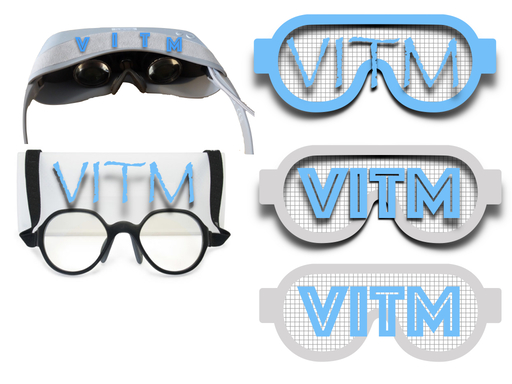

  </td><td width='50%'>

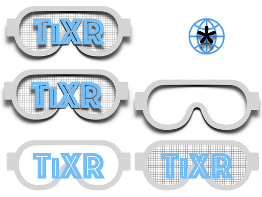
  </td></tr></table>
</td></tr></table>
 

### Experience Prototyping
This section iterates the design elements of each sub-room (exhibit) within the experience.

<table>
  <tr ><td width='50%'>

**Enhanced Content** - Enhanced content refers to the ability to detect on-screen content (a device, tv, computer, etc.) and offer additional connection or information options.  Typically, this means links to other actor information or facts about a television show or movie.  One use of enhanced content is for on-screen actions (like a "buy now" button on your TV) or passage of content to a second screen.  This room was designed to model a living room (first image) and allow second-screen content on a mobile device (second image).
</td><td>
  <table>
  <tr ><td width='50%'>

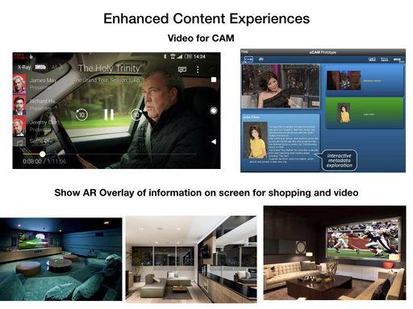
  </td><td width='50%'>

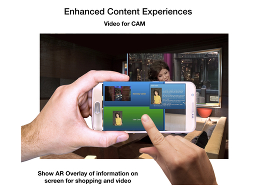

  </td></tr></table>  
</td></tr><tr><td>

**Network Planning** - Network planning XR is a task that several industries can benefit from.  This image demonstrates how a city can be overlaid in a virtual environment with the signal strength, available resources, or other attributes within a network. Several companies have started offering ready-to-go systems for XR exploration of location-locked resources.  This room is designed to demonstrate one or more network planning tasks.

</td><td>

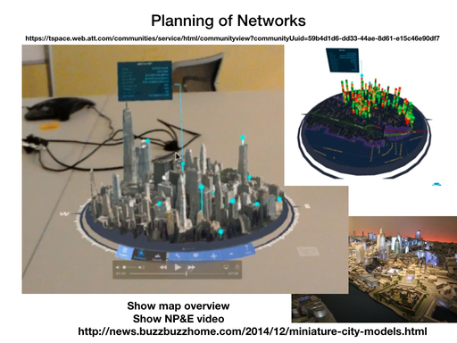
</td></tr><tr><td>

**Diagnostics and Security** - Although more experimental, complicated decisions and network topologies have begun to be visualized with graph-displays.  Specifically, a graph representation is one where multiple nodes (points) are connected to each other via an edge.  Users manipulate the graph by spinning, enlarging, and possibly moving individual nodes within the graph while exploring the interconnectivity of the network.  This room is designed to demonstrate some exploration capabilities and possibly discuss the use-case needs for this technology.

</td><td>

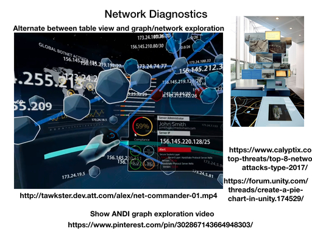
</td></tr><tr><td>

**Content Caching** - Intelligent content caching is the ability to better cache parts of an expensive AR query (e.g. capture, upload, recognition, retrieval) for audio or video assets.  Now that the AR recognition functionality is becoming more of a commodity, the best use of the network, connected nodes, and information caches can be improved for a better user experience.  This room design should include the physical set-up of one or more people.

</td><td>

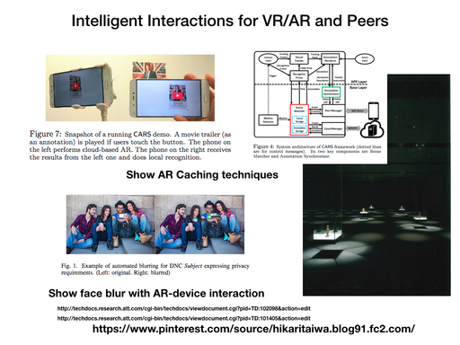
</td></tr><tr><td>

**360 Video Encoding** - Video encoding optimization demonstrates the ability to save in bitrate/bandwidth based on where the user is looking.  For example, if the user is always facing the front of the display, it is wasteful to encode the back and sides at full resolution and bitrate.  This room should include some visualizations for demonstrating the encoding ratio (high vs. low) and possibly a "simulated" 360 video.

</td><td>
  <table>
  <tr ><td width='50%'>

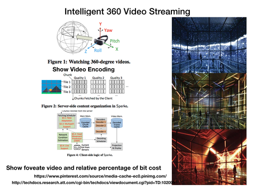
  </td><td width='50%'>

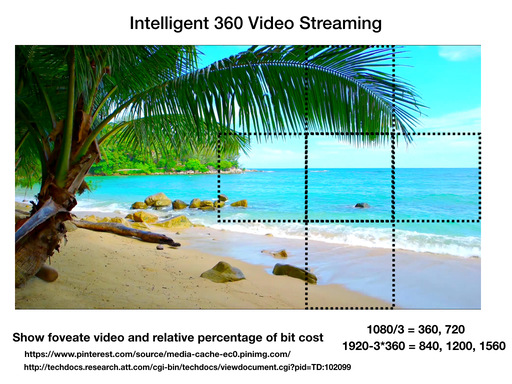
  </td></tr></table>  
</td></tr></table>

## Interactions
Interactions are associated with getting around the game as well as the respective min-games for each room.  Specifically, interactions for a room may be totally passive (reading displays or watching a video) or active, like clicking a display or having to pick the best object from a set of objects.  This section details design choices made *before* user testing began.

### Gameplay

* Navigation and interactions with objects; meshes and triggers for walking plane
    * Some rooms will have objects that can be clicked on; at a minimum, the room should have a video with audio and video that is relevant to the topic.
* Creating [analytics triggers](https://stackoverflow.com/a/23052854) for entry and exit of rooms
    * Exploring the deployment and uptake of a the experience, analytics have been associated with the app to know how long a user spent in a specific area or interacting with a specific mini-game in a room.
* Linking triggers to audio and content activation for volume control
    * To help control other visual or audio cues, triggers may be necessary to change aspects in the scene.

# User testing
## Initial Usability

Initially the user was pleased with the environment, but a few spatial oddities did set in. Namely, the user complained that the movement felt artificial and that the visual height of the movement (or the presence in the world) felt 'off'.  Additionally, the primary test user found the initial textures chosen (wall and floor textures) to be quite atypical for a museum display.  To address these issues, the following modifications were made.

1. *navigation* - Added walking sounds while in motion; this sound is a simple foot-step loop
with four steps to give some minor variance
2. *movement* - Brought the camera closer to the ground
3. *orientation* - Guaranteed a consistent viewing angle (e.g. no in-game camera rotation)
4. *movement* - Various speeds for the camera walk such that it eases out of the movement; different tweening types and teleporting was also attempted but neither was well received.
5. *appearance* - Modified the texture to cleaner, simpler textures. 
    * 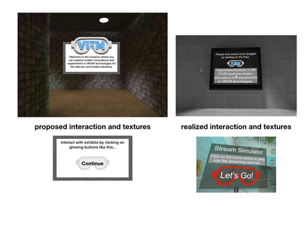

# Final Walkthrough

This section iterates design choices (and their point in the above video) for each part of the experience. 
* Watch the complete [walkthrough video](https://youtu.be/xj3qLvDK4gQ).
    * .  
* Ultimately, the final layout utilized a square center/NOC region with different rooms as off-shoots with small hallways.  Triggers were placed at the hallway entrances for each room, which doubled as a sound mute option for any ambient audio that was within a room.
    * 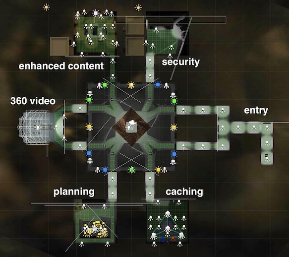

<table>
  <tr ><td width='50%'>

**The Entry Path** ([video](https://youtu.be/xj3qLvDK4gQ?t=13s)) - The entry path was created with a simple, direct hallway structure that leads the user into the experience.  Per the design requirements, instructions for orientation (navigation) and basic background for the museum are included as in-game displays.
</td><td width='50%'>

</td></tr><tr><td>

**The Center / NOC** ([video](https://youtu.be/xj3qLvDK4gQ?t=30s)) - The NOC was created in a more subdued tone than originally expected.  Instead of large extra pieces of furniture, elaborate lights, or other complicated displays, a set of repeating -- but large scale -- displays were created along the walls.  Also, an entry sign for each of the exhibits was created as a teaser and a nod to traditional museums that often have similar introductory plaques.  Early struggles with the design tool (ultimately ProBuilder but initially Blender) and the lack of available models matching the area lead to more time required than usual.  Similarly, geometry requirements of initial designs (rounded floors, multi-tier paths) had to be rethought as the different rooms and overall navigation were brought into play.  The biggest setback was capturing a proper scale for the user to interact with that matched the grand scale of the NOCs found in typical industry locations.  A challenge in this room was getting the lighting levels and room sizing adequate for a user experience.
</td><td>

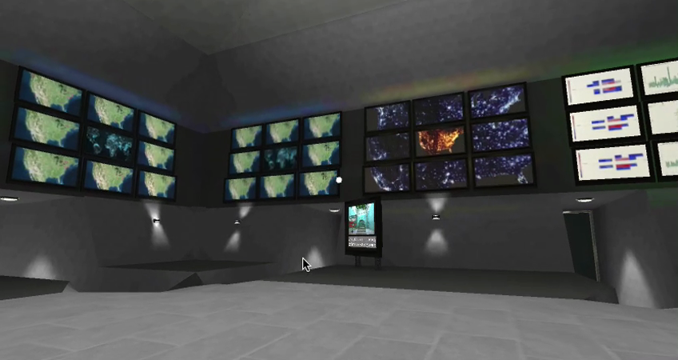
</td></tr><tr><td>

**Enhanced Content** ([video](https://youtu.be/xj3qLvDK4gQ?t=2m15s)) - Enhanced content here used an application called CAM (content augmenting metadata) for various content analysis techniques and a companion app that could receive augmented visuals, audio, and information from analysis.  As the player triggers the entry door, a phone visual comes into focus and begins playing a secondary video.  Although this object does not move much, it does move towards and away from the reticle after fast movements by the camera.  One challenge here (*that remains unsolved at the time of writing, unfortunately*) is keeping the audio and video in sync across multiple different sources: a video tied to a texture, audio from that texture that goes through a GVR spatial audio object, and a re-encoded video for the secondary display.  This problem manifests as the game is played longer and the loops across the different sources begins to loose synchronization.  One interesting effect here was the use of a window effect that allowed a skybox to be seen through the main room windows.
</td><td>
  
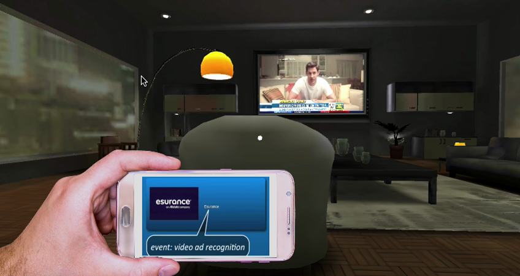
</td></tr><tr><td>

**Network Planning** ([video](https://youtu.be/xj3qLvDK4gQ?t=5m36s)) - Network planning utilizes a video wall (for smart electrical grids), a simulated city area (miniaturized to be on a table), and a mini-game that would encourage users to distribute the "load".  Unfortunately, the game wasn't quite finished (at the time of writing), but the rest of the experience is a fun item to inspect.  Tweening was utilized to get the user in position for the game (seen in this screenshot), but he or she can still navigate the stairs if desired.  Some complications for this room came from miniaturizing the city, which did not necessarily scale lighting and other textures appropriately.  If done again, a lower-poly model would be used for better visual appearance and likely a smaller final build.
</td><td>
  
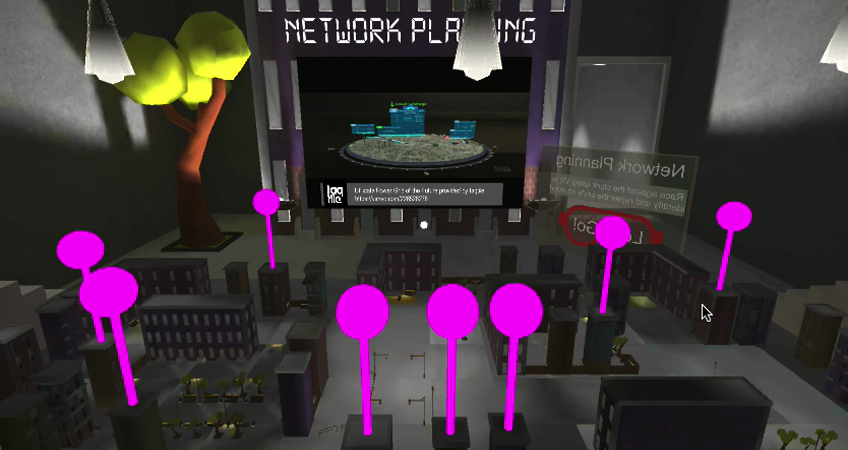
</td></tr><tr><td>
Â∏
**Diagnostics and Security** ([video](https://youtu.be/xj3qLvDK4gQ?t=53s)) - Following the initial design quite closely, this room prominently displays a video from a prototype system along with an interactive information display about common security attacks.  This room was the first to be created for the project, so some aspects of scale and interactions were not totally perfected (e.g. the view angle and size of user versus room).  Also, the information display in this room is quite dense, versus the ability to read in a VR environment, but user testing didn't report any strong rejection of interaction.
</td><td>
  
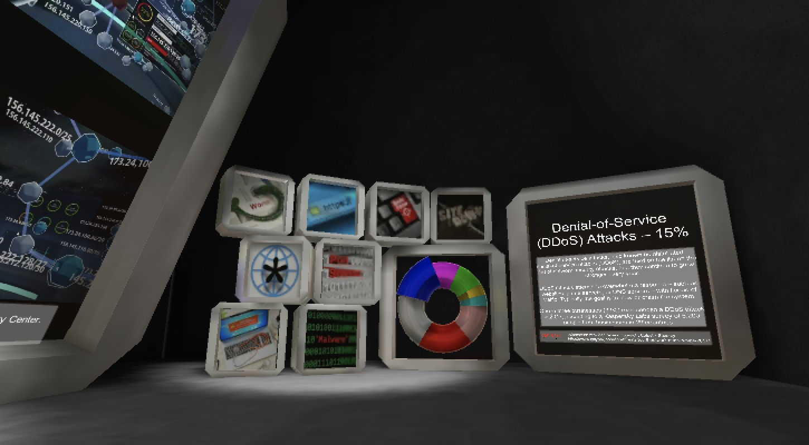
</td></tr><tr><td>

**Cached Content** ([video](https://youtu.be/xj3qLvDK4gQ?t=6m57s)) - The cached content room was created to demonstrate the flow of information from an AR interaction.  This room had the least source material to start from, so it depended largely on creating a new experience.  Although incomplete (at time of writing), the mini-game experience would show data (s a glowing object) flowing between different nodes in the AR process.  However, the room implementation came close to the initial design, with a mostly dark room and a few objects of focus.  To offset this shortcoming, parts of the research paper that inspired this room were included on the informational displays in the back of the room. 
</td><td>
  
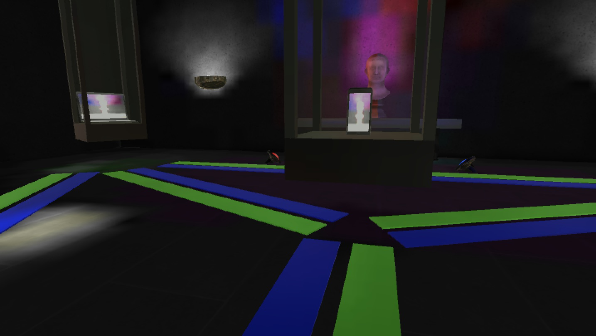
</td></tr><tr><td>

**360 Encoding** ([video](https://youtu.be/xj3qLvDK4gQ?t=4m1s)) - To emphasize the impact of efficient encoding, a virtual dome was created with multiple indicators for encoding throughput.  Here, the user would enter the streaming simulator and watch as performance indicators change based on viewing angle.  An additional slider in the display allows the user to evaluate performance indicators under high- and low-bandwidth conditions, which effectively modify the math used to compute the simulated performance numbers.  It should be noted that the crude 360 room effect (five tiled walls from a 360 video) were an intentional approximation of true 360 video experience to keep the illusion of a physical room in a museum consistent.
</td><td>
  
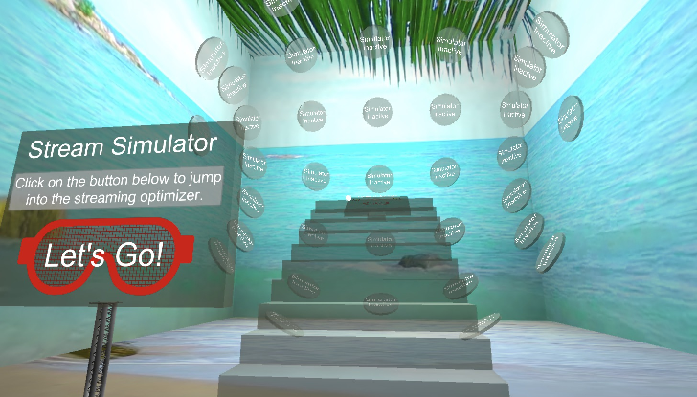
</td></tr></table>

## Struggles and Compromises
A number of struggles were encountered during the development of this project.  While it could be argued that the content went beyond the requested scope of the museum application, the result provided learning opportunities for video manipulation, enhanced camera and player interaction, and creation of a large, cohesive environment.  

* diagnostic and security room  - Objects that floated in a virtual space needed to have special physical interaction defined; for example, how does a 3d object obscure other parts of a display?
* recurring problems with video - Across different rooms, the creation (and reliable replay) of video was challenging.  From jumpy mp4 files to splitting a single video into skybox-like usage, generally, the video textures available in Unity were often inadequate.  

### Comments
* Successes (novel experiences from design)
    * Camera-attached interactions - The creation of a "companion device" that was ever-present in the user's view created some interesting interaction dynamics for a camera and device.
    * Simulation of 360 encoding by view - Using some simple math and a spatial location, a responsive and entertaining simulation of encoding performance was created.
* Struggles (and learning opportunities) overcome
    * Video encoding for the project; still unsolved for some content
    * Creation of the main environment (learned a new tool, [ProBuilder](http://www.procore3d.com/probuilder/))
    * Integration of tweening for smooth animations, switched to [LeanTween](http://dentedpixel.com/LeanTweenDocumentation/classes/LeanTween.html)
    * Faulty rendering with large-memory objects (render engine as GLES), [answered with some forum help](https://discussions.udacity.com/t/all-white-textures-rendering-on-android-app/502165/2)

# Conclusions
This application was a good capstone to creation of a VR environment that combines design creativity with physical and technical execution.  It is expected that this application *will be* presented to STEM students as an introductory experience to the telecommunications industry, so the ability to explore a few technical innovations in VR is an appreciated windfall.

## Future work
While the informational displays were created, several mini-games and small items to tune could have used additional time.  The short list below tries to iterate some of these items for future reference.  

* Future TODO:
    * Add furniture to main room for NOC-style viewership
    * Add moving videos or something dynamic to displays in main room
    * Make a game or inspection requirement for net room
    * Improve lighting of toy city in net room; finish game in net planning room
    * Add ceiling lighting for main room
    * Finish interaction in cache room (zapping and moving visuals along ground)
* Tuning for usability
    * video load lagging and [eliminating jitter and delay](https://answers.unity.com/questions/17409/best-video-preparation-for-unity.html)
    * Unity color palette for low-vision - http://bconnelly.net/2013/10/creating-colorblind-friendly-figures/, http://www.perbang.dk/rgbgradient/
